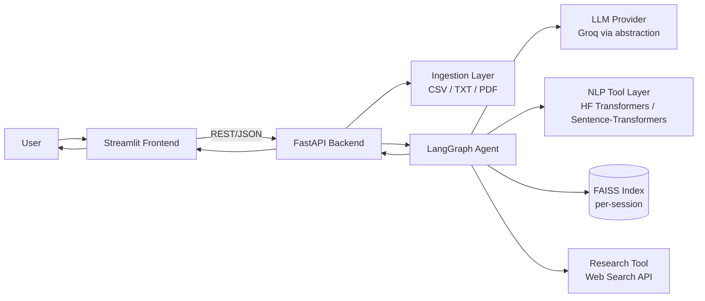

# TextInsight

An agentic NLP platform that routes natural-language questions to task-specific pretrained models,
chains tools automatically for multi-step questions, and produces evidence-separated, research-backed
model recommendations — without training or fine-tuning anything.

## Overview

TextInsight lets a user upload a CSV, TXT, or PDF and ask a natural-language question — "why are
customers unhappy?", "should I use BERT or DistilBERT?" — and get back a routed, multi-step answer
instead of a single canned response.

An LLM (via Groq) is used only for intent understanding and tool-sequence planning. It does not perform
the NLP work itself: sentiment analysis, classification, summarization, and semantic search are all
executed by dedicated Hugging Face `transformers` pipelines and `sentence-transformers` embeddings. This
separation — LLM plans, purpose-built models execute — is the core architectural decision behind the
project.

The same discipline extends to the model-recommendation feature: measured accuracy on the user's own
data, external research findings, and system judgment are kept as three distinct, labeled outputs rather
than merged into one narrative. If a tool is skipped or a data source is unavailable, the response says
so explicitly instead of omitting it.

## Key Capabilities

**Core NLP**
- Dataset/text profiling
- Sentiment analysis
- Zero-shot text classification
- Summarization (single-document and multi-document digest)
- Semantic search (FAISS)
- Deterministic result filtering

**Agent Orchestration**
- Multi-step tool workflows planned and executed automatically
- Conditional routing with re-planning around recoverable failures
- Session-scoped conversational follow-ups
- Visible workflow trace and per-step latency in the UI

**Model Guidance**
- Dataset-aware candidate model shortlist
- Inference-only accuracy evaluation on user-labeled data (`evaluate_candidates` — never trains or
  updates weights)
- Research-backed context via live web search, with graceful degradation when unavailable
- Fine-tune-vs-pretrained advisory with an explicit no-training disclaimer

**Named Entity Recognition:** not currently implemented. It was scoped as a SHOULD-HAVE and deprioritized
in favor of the agent-routing evaluation and the measured-evaluation feature (see [Limitations](#limitations)).

## Architecture



### Agent Workflow

The agent is a LangGraph state machine, not a scripted if/else:

```
understand_intent → plan_steps → execute_tool → conditional routing → synthesize
```

- **`understand_intent`** — the LLM plans a tool sequence from the user's question.
- **`plan_steps`** — deterministic, cache-aware refinement of that plan.
- **`execute_tool`** — runs the next planned tool.
- **Conditional routing** — loops back to `execute_tool`, re-plans around a recoverable problem, or
  proceeds to `synthesize`.
- **Bounded max-iteration guard** — prevents an unbounded planning loop.
- **`handle_error`** — fallback path for unrecoverable failures.

Full node/edge design: [`docs/ARCHITECTURE.md`](docs/ARCHITECTURE.md).

## Tech Stack

| Layer | Technology |
|---|---|
| Language | Python 3.11+ |
| Agent | LangGraph + LangChain |
| LLM | Groq (`langchain_groq`), behind a provider-agnostic `LLMClient` interface |
| NLP inference | Hugging Face `transformers` pipelines + `sentence-transformers` |
| Vector search | FAISS |
| Data | Pandas + NumPy |
| PDF | PyMuPDF (`fitz`) |
| Backend | FastAPI + Uvicorn |
| Frontend | Streamlit |
| Validation | Pydantic v2 |
| Research | Tavily API, behind a provider-agnostic `ResearchClient` interface |
| Session state | Redis |
| Deployment | Docker + Docker Compose |

Technology-selection rationale is documented in [`docs/TECH_STACK.md`](docs/TECH_STACK.md).

## Installation

Requires Python 3.11+. No GPU required — every default model is chosen to be CPU-tractable.

### Local

```bash
python -m venv .venv
source .venv/bin/activate
pip install -r requirements.txt
```

The first run of any NLP tool downloads its Hugging Face model weights; subsequent runs use the local
cache.

### Docker

```bash
docker compose up --build
```

Builds and starts the FastAPI backend and Streamlit frontend containers. No local Python environment is
required — this is an equally supported way to run the project, not a fallback.

## Configuration

```bash
cp .env.example .env
```

| Variable | Required | Notes |
|---|---|---|
| `GROQ_API_KEY` | Yes | Powers intent planning, synthesis, and model-recommendation reasoning |
| `GROQ_MODEL` | No | Defaults to a fast tool-calling-capable model; override if Groq's catalog changes |
| `TAVILY_API_KEY` | No | Research degrades gracefully to "not available" if unset |
| `HF_HOME` | No | Override the Hugging Face model cache location |
| `MAX_UPLOAD_MB`, `MAX_ROWS`, `MAX_PDF_PAGES` | No | Upload/ingestion limits |

The same `.env` file is used for both local and Docker Compose runs; values are never baked into images.

## Usage

**Local:**

```bash
uvicorn backend.main:app --reload
streamlit run frontend/app.py
```

Streamlit: `http://localhost:8501`. Backend: `http://localhost:8000` (override with `BACKEND_URL`).

**Docker:**

```bash
docker compose up --build
```

Streamlit: `http://localhost:8501`. Backend's *host*-side port is `8080`, not `8000` — deliberately
different, since 8000 is commonly already in use locally. This only affects access from outside Docker
(e.g. `curl`); the frontend container reaches the backend container internally without adjustment.

Upload a CSV/TXT/PDF in the sidebar, then ask a question in the chat box. The workflow panel shows which
tools ran and in what order; the latency panel (collapsed by default) shows the per-step timing
breakdown.

## Example Queries

Routing for these ten queries is covered by an automated evaluation suite (`tests/eval_routing.py`); see
[Evaluation & Benchmarks](#evaluation--benchmarks) for the measured pass rate.

| Query | Workflow |
|---|---|
| "Analyze the sentiment" | Single-tool: sentiment analysis |
| "Classify these complaints into billing/technical/delivery/refund" | Single-tool: zero-shot classification |
| "Extract organizations and people" | Not supported — NER is not implemented |
| "Summarize these documents" | Single-tool: summarization |
| "Find complaints about delayed delivery" | Semantic search over the corpus |
| "Why are customers unhappy?" | Multi-step: sentiment → filter → semantic grouping → summarize |
| "Should I use BERT or DistilBERT?" | Model recommendation: measured accuracy + external research |
| "Should I use a pretrained model or fine-tune?" | Model recommendation: fine-tune-vs-pretrained advisory |
| "Show me only negative reviews and summarize them" | Multi-step: filter → summarize |
| "Which model gives the best latency for this task?" | Model recommendation: constraint-driven |

## Evaluation & Benchmarks

### Agent Routing

`tests/eval_routing.py` runs the 10 example queries live against Groq (not mocked) and checks tool-sequence
routing: **100% (10/10)**, last verified live on 2026-09-02. This reflects routing accuracy on this
specific 10-query evaluation set, not a general reliability guarantee.

The full multi-step diagnostic workflow and a full-app smoke test (all 10 example queries through the
live FastAPI endpoints, plus two `agent_graph_integration` diagnostic/semantic-search workflow tests) also
passed live as of 2026-09-02. Firing all 10 smoke-test queries back-to-back in one batch can trip Groq's
per-minute token rate limit (`openai/gpt-oss-20b`'s on-demand tier caps at 8,000 TPM); run individually or
spaced out and every query completes with `error: null`.

### Latency Benchmarks

Measured locally on macOS, CPU-only, Python 3.11.9 — median of 3 warm runs (`scripts/benchmark.py`)
against a 50-row synthetic review dataset (`tests/fixtures/csv/benchmark_reviews.csv`) unless noted. These
are local, single-machine measurements, not formal production benchmarks. Cold-start (first call, includes
model download/load) is reported separately from warm/steady-state, since combining them misrepresents
steady-state performance.

| Step | Cold (first call) | Warm (median, n=3) | Warm range |
|---|---|---|---|
| `profile_dataset` | — | 32 ms | 30–228 ms |
| `sentiment_analysis` (batch of 50) | 3,314 ms | 219 ms | 219–219 ms |
| `text_classification` (zero-shot, batch of 50) | 6,764 ms | 4,881 ms | 4,694–4,982 ms |
| `summarize_text` (batch digest, 50 docs) | 3,391 ms | 2,412 ms | 2,393–2,512 ms |
| `generate_embeddings` (index build, 50 docs) | 3,140 ms | 24 ms | 23–25 ms |
| `semantic_search` (query only) | — | 11 ms | 10–104 ms |
| `evaluate_candidates` (2 candidates × 25 labeled examples) | 1,960 ms | 279 ms | 271–280 ms |

Zero-shot classification is the slowest default tool even warm (one forward pass per candidate label),
consistent with [`docs/LATENCY_AND_PERFORMANCE.md`](docs/LATENCY_AND_PERFORMANCE.md)'s expectation.

## Reliability & Concurrency

Offloading `/query`'s agent execution to a thread pool (2026-09-02, see `LOAD_TEST_RESULTS.md`) let
concurrent requests genuinely run in parallel, which surfaced two independent concurrency issues.

### Model initialization race — fixed

Concurrent first-time model loading was unsafe: `transformers`' shared internal lazy-import state could
be corrupted when two threads loaded a model for the first time simultaneously, crashing the process
under load. Locking each model cache individually was not sufficient, since the race lived in
`transformers`' own state, not in either cache. Resolution: every default model, plus every model in
`model_recommendation.py`'s candidate shortlists (including the non-default models reachable through
`evaluate_candidates`), is loaded eagerly at process startup, before the server accepts traffic — so no
request is ever first to load a model. Verified with a passing concurrent load test against the reachable
`evaluate_candidates` path. Full numbers and verification detail: [`LOAD_TEST_RESULTS.md`](LOAD_TEST_RESULTS.md).

### Redis session race — identified, not fixed

`SessionStore.update_profile` and `SessionStore.append_turn` perform a plain Redis read-modify-write
(`get` → mutate → `set`), not an atomic transaction. Two concurrent requests against the same
`session_id` (e.g. two browser tabs on one session) can race, with the second `set` silently overwriting
the first's `chat_history` or profile update. This became reachable — not introduced — by the
thread-pool change above. **This is documented, not fixed.** A real fix would need a Redis transaction
(`WATCH`/`MULTI`/`EXEC`) or an append-only Redis list for `chat_history`. Details:
[`docs/SECURITY_AND_RELIABILITY.md`](docs/SECURITY_AND_RELIABILITY.md) §13.

## Limitations

| Area | Limitation |
|---|---|
| Training | No model training or fine-tuning anywhere in the system — guidance only |
| NER | Not implemented (deprioritized SHOULD-HAVE); declined honestly rather than faked |
| Candidate evaluation | `evaluate_candidates` runs through the sentiment-analysis pipeline with no separate task-type parameter, so measured accuracy is meaningful primarily for sentiment-style labeled datasets today |
| Zero-shot classification | Slowest default tool, even warm (one forward pass per label) |
| Multi-step diagnostic workflow | Slowest default flow, by composition |
| Research credibility filtering | Source-type-based heuristic, not deep fact-checking |
| Session persistence | Redis-backed, survives backend restarts as long as Redis stays up; still a single-instance deployment target — no clustering/replication |
| Session concurrency | Concurrent requests on the same `session_id` can race (see [Reliability & Concurrency](#reliability--concurrency)) — unresolved |
| Language support | English-first models by default; other languages not validated |
| PDF support | No OCR — scanned/image PDFs with no extractable text are not supported |
| Rate limits | Running all 10 smoke-test queries as one rapid batch can trip Groq's per-minute token rate limit on the free/on-demand tier; sequential or spaced-out runs complete cleanly |

## Future Work

- Optional local/offline LLM provider for fully offline operation
- User-supplied labeled evaluation data for real measured model comparisons beyond sentiment tasks
- Persistent multi-session project workspaces
- Streaming token-level / step-level responses in the UI
- Broader language support

## Documentation

- [`docs/ARCHITECTURE.md`](docs/ARCHITECTURE.md) — full agent/graph node and edge design
- [`docs/TECH_STACK.md`](docs/TECH_STACK.md) — technology-selection rationale, including Redis session state
- [`docs/MODEL_RECOMMENDATION.md`](docs/MODEL_RECOMMENDATION.md) — model-recommendation feature design
- [`docs/LATENCY_AND_PERFORMANCE.md`](docs/LATENCY_AND_PERFORMANCE.md) — latency instrumentation strategy
- [`docs/SECURITY_AND_RELIABILITY.md`](docs/SECURITY_AND_RELIABILITY.md) — known limitations and concurrency findings
- [`LOAD_TEST_RESULTS.md`](LOAD_TEST_RESULTS.md) — concurrent load test methodology and results
