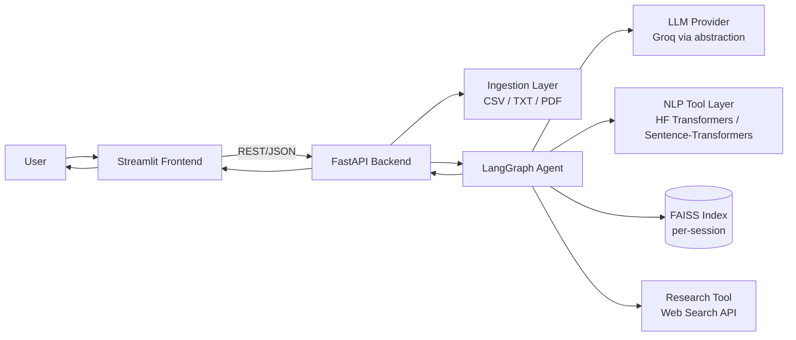

# TextInsight

An agentic NLP platform (LangGraph + FastAPI + Streamlit) that routes natural-language questions to the
right pretrained-model pipeline — sentiment, classification, summarization, semantic search — chains tools
automatically for multi-step questions, and gives evidence-separated, research-backed model recommendations
without ever training or fabricating results.

## Demo

Run locally (see [Usage](#usage) below) — upload a CSV/TXT/PDF, then ask a question like "Why are customers
unhappy?" and watch the agent plan, execute a chain of tools, and explain the result with a visible
workflow trace and per-step latency.

## Architecture



The agent is a LangGraph state machine, not a scripted if/else: `understand_intent` (LLM plans a tool
sequence) → `plan_steps` (deterministic cache-aware refinement) → `execute_tool` (runs the next planned
tool) → a conditional router that loops back to `execute_tool`, re-plans around a recoverable problem, or
proceeds to `synthesize` — with a bounded max-iteration guard and a `handle_error` fallback for genuine
failures. See `docs/ARCHITECTURE.md` for the full node/edge design.

## Features

**NLP Capabilities:** dataset/text profiling, sentiment analysis, zero-shot text classification,
summarization (single-doc and multi-doc digest), semantic search (FAISS), deterministic result filtering,
multi-step workflow orchestration, session-scoped conversational follow-ups.

**Model Guidance:** dataset-aware model/approach recommendation (rule-based candidate shortlist + LLM
reasoning), real measured accuracy on the user's own labeled data (`evaluate_candidates` — inference-only
scoring, never training), research-backed recommendations (live web search via Tavily, degrades gracefully
when unavailable), fine-tune-vs-pretrained advisory with a templated no-training disclaimer.

**Platform:** CSV/TXT/PDF upload, per-tool and end-to-end latency measurement, LLM-synthesized explanations
grounded in structured tool output, visible agent workflow/status in the UI.

**Not implemented:** Named Entity Recognition was deprioritized (SHOULD-HAVE, not MUST-HAVE) to protect
build time for the agent-routing evaluation and the real-measured-evaluation feature — see Limitations.

## Tech Stack

| Layer | Technology |
|---|---|
| Language | Python 3.11+ |
| Agent | LangGraph + LangChain |
| LLM | Groq (`langchain_groq`), behind a provider-agnostic `LLMClient` interface |
| NLP inference | Hugging Face `transformers` pipelines + `sentence-transformers` |
| Vector search | FAISS |
| Data | Pandas + NumPy |
| PDF | PyMuPDF (`fitz`) |
| Backend | FastAPI + Uvicorn |
| Frontend | Streamlit |
| Validation | Pydantic v2 |
| Research | Tavily API, behind a provider-agnostic `ResearchClient` interface |
| Deployment | Docker + Docker Compose |

Full rationale for each choice is in `docs/TECH_STACK.md`.

## Installation

Requires Python 3.11+.

```bash
python -m venv .venv
source .venv/bin/activate
pip install -r requirements.txt
```

The first run of any NLP tool downloads its Hugging Face model weights (cached locally afterward). No GPU
is required — every default model is chosen to be CPU-tractable.

**Alternative: Docker.** `docker compose up --build` builds and starts both the FastAPI backend and
Streamlit frontend containers — no local Python environment needed. This is an equally valid way to run the
project, not a fallback.

## Configuration

Copy `.env.example` to `.env` and fill in your keys:

```bash
cp .env.example .env
```

| Variable | Required | Notes |
|---|---|---|
| `GROQ_API_KEY` | Yes | Powers intent planning, synthesis, and model-recommendation reasoning |
| `GROQ_MODEL` | No | Defaults to a fast tool-calling-capable model; override if Groq's catalog changes |
| `TAVILY_API_KEY` | No | Research degrades gracefully to "not available" if unset |
| `HF_HOME` | No | Override the Hugging Face model cache location |
| `MAX_UPLOAD_MB`, `MAX_ROWS`, `MAX_PDF_PAGES` | No | Upload/ingestion limits |

The same `.env` file is used whether running locally or via Docker Compose — values are never baked into
the images.

## Usage

**Local:**

```bash
uvicorn backend.main:app --reload
streamlit run frontend/app.py
```

Streamlit is reachable at `http://localhost:8501`; it talks to the FastAPI backend at
`http://localhost:8000` (override with the `BACKEND_URL` environment variable).

**Docker:**

```bash
docker compose up --build
```

Streamlit is reachable at `http://localhost:8501` either way.

**Walkthrough:** upload a CSV/TXT/PDF in the sidebar (you'll see a profiling summary once it's processed),
then ask a question in the chat box. The workflow panel shows which tools ran and in what order; the
latency panel (collapsed by default) shows the full per-step timing breakdown.

## Example Queries

The agent's tool-sequence routing across these ten queries is the subject of an automated evaluation suite
(`tests/eval_routing.py`) — see Latency Benchmarks below for the measured pass rate.

| Query | Triggers |
|---|---|
| "Analyze the sentiment" | Single-tool: sentiment analysis |
| "Classify these complaints into billing/technical/delivery/refund" | Single-tool: zero-shot classification |
| "Extract organizations and people" | Named entity recognition *(not implemented — see Limitations)* |
| "Summarize these documents" | Single-tool: summarization |
| "Find complaints about delayed delivery" | Semantic search over the corpus |
| "Why are customers unhappy?" | Multi-step diagnostic chain: sentiment → filter → semantic grouping → summarize |
| "Should I use BERT or DistilBERT?" | Model recommendation with real measured accuracy + external research |
| "Should I use a pretrained model or fine-tune?" | Model recommendation, fine-tune-vs-pretrained advisory |
| "Show me only negative reviews and summarize them" | Explicit multi-step: filter → summarize |
| "Which model gives the best latency for this task?" | Model recommendation, constraint-driven |

## Latency Benchmarks

Measured locally on macOS, CPU-only, Python 3.11.9, median of 3 warm runs (`scripts/benchmark.py`) against
a 50-row synthetic review dataset (`tests/fixtures/csv/benchmark_reviews.csv`) unless noted. These are
local, single-machine measurements, not formal benchmarks — cold-start (first call, includes model
download/load into memory) is reported separately since it materially misrepresents steady-state speed.

| Step | Cold (first call) | Warm (median, n=3) | Warm range |
|---|---|---|---|
| `profile_dataset` | — | 30 ms | 29–248 ms |
| `sentiment_analysis` (batch of 50) | 3,596 ms | 221 ms | 220–237 ms |
| `text_classification` (zero-shot, batch of 50) | 6,163 ms | 4,972 ms | 4,972–5,050 ms |
| `summarize_text` (batch digest, 50 docs) | 3,355 ms | 2,635 ms | 2,568–2,779 ms |
| `generate_embeddings` (index build, 50 docs) | 3,228 ms | 25 ms | 24–26 ms |
| `semantic_search` (query only) | — | 26 ms | 16–117 ms |
| `evaluate_candidates` (2 candidates × 25 labeled examples) | 2,431 ms | 407 ms | 352–423 ms |

Zero-shot classification is, as flagged in the design docs, the slowest default tool even warm (one forward
pass per candidate label) — consistent with `docs/LATENCY_AND_PERFORMANCE.md`'s expectation.

**Agent routing accuracy** (`tests/eval_routing.py`, live against Groq, not mocked): **100% (10/10)** across
three consecutive runs, after a prompt fix mid-build raised it from an initial 80%.

**Full multi-step diagnostic workflow and full-app smoke test** (all 10 example queries, live through the
actual FastAPI endpoints): verified live for the diagnostic chain and semantic search workflows during
development. The complete 10-query full-app smoke test hit Groq's daily token quota near the end of this
build and could not be fully re-verified live before this README was written — see Limitations.

## Limitations

- No model training or fine-tuning is performed anywhere — model guidance only. See
  `docs/MODEL_RECOMMENDATION.md`.
- Named Entity Recognition is not implemented (deprioritized SHOULD-HAVE). A query asking for it is
  honestly declined rather than faked.
- `evaluate_candidates` scores candidates through Hugging Face's sentiment-analysis pipeline internally and
  has no separate task-type parameter — model recommendation's real-measured-accuracy feature (Section A)
  is therefore only meaningful for sentiment-style labeled datasets today, not classification/NER/other
  tasks.
- Zero-shot classification and the multi-step diagnostic workflow are the slowest default flows (see
  benchmarks above).
- Research evidence credibility filtering is source-type-based only, not deep fact-checking.
- Session-scoped state only, in-process — no database, no persistence across a server restart (a deliberate
  design choice, not a gap; see `CLAUDE.md` §3.5).
- English-first models by default; other-language support is not validated.
- Scanned/image PDFs (no extractable text) are not supported — no OCR.
- The full 10-query full-app smoke test could not be completely re-verified live in one sitting due to a
  third-party API daily rate limit encountered near the end of this build (see Latency Benchmarks above).

## Future Work

- Optional local/offline LLM provider for fully offline operation.
- User-supplied labeled evaluation data for real measured model comparisons beyond sentiment tasks.
- Persistent multi-session project workspaces.
- Streaming token-level / step-level responses in the UI.
- Broader language support.
