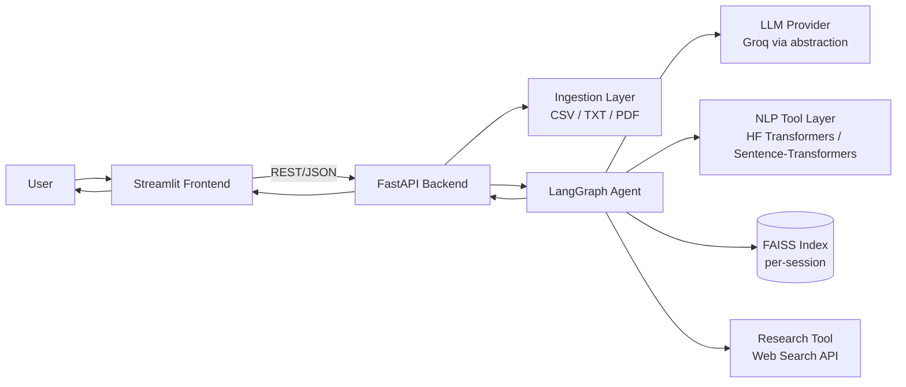
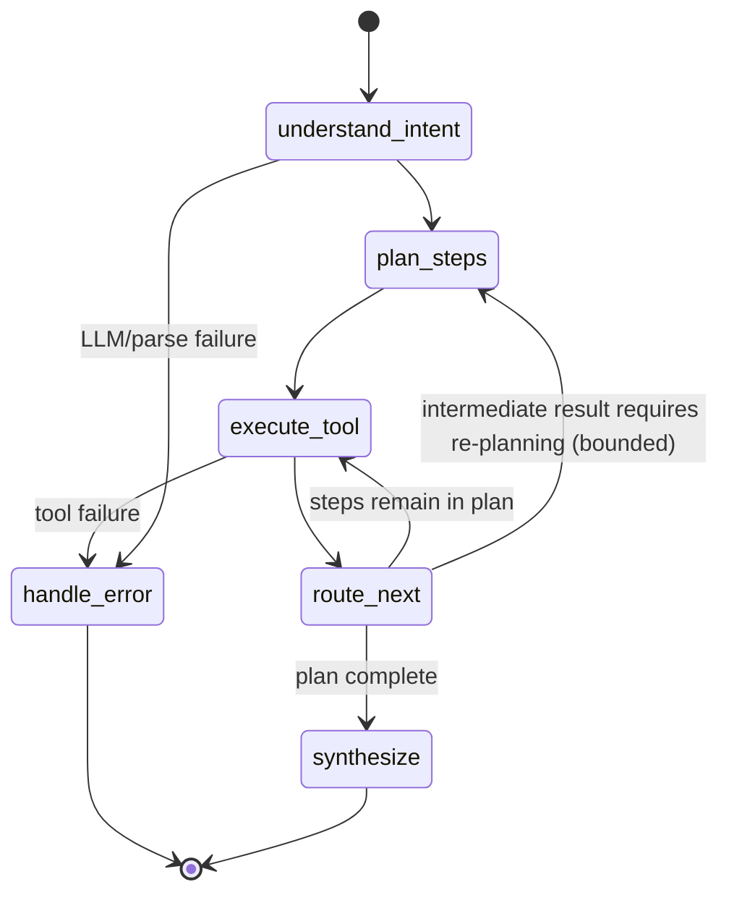
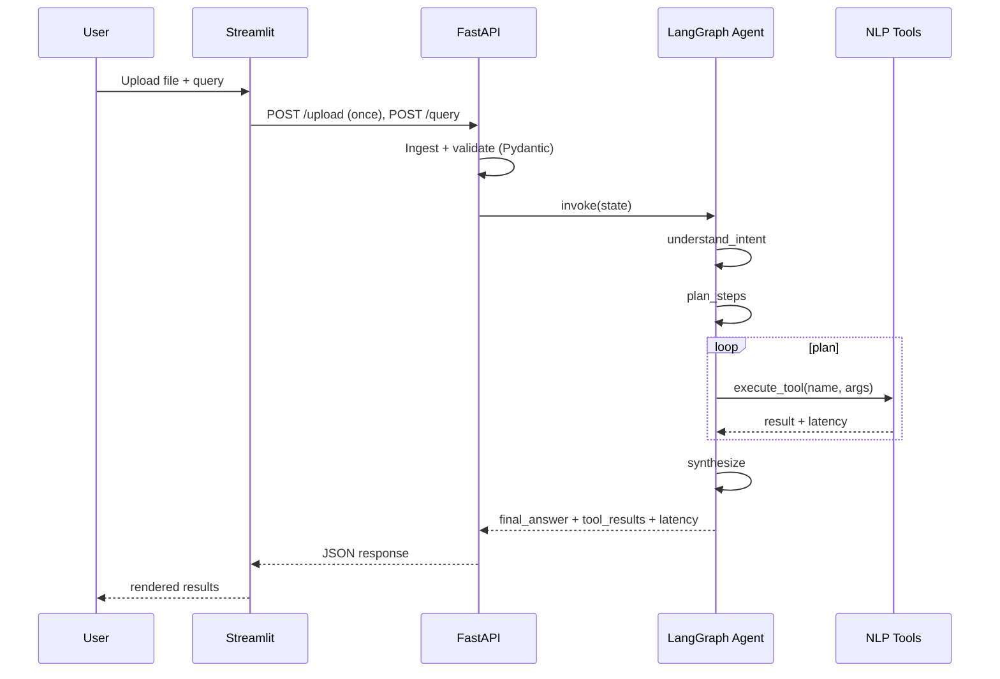

# ARCHITECTURE.md — TextInsight

## 0. Starter-Project Inspection (Reuse / Refactor / Remove)

Source inspected: `ai_driven_ml_and_datascience_assistant.ipynb` (an "AI-Driven ML and Data Science
Assistant" built for AutoML-style tabular analysis on a single hardcoded Kaggle dataset, NY housing prices).
Findings are from the actual code, not just the described issues.

### What the notebook actually does
- Downloads one fixed CSV via `kagglehub` into a **module-level global `df`**.
- Defines ~16 functions (missing-value checks, outlier detection, distribution analysis, scaling, encoding,
  feature selection, polynomial features, dimensionality reduction, sklearn classification/regression
  training+CV, a generic `operations_on_dataset` dispatcher, CSV export).
- Binds only **10 of those ~16** functions to the LLM via `llm.bind_tools(tools)`; the rest
  (`handle_missing_values`, `encode_categorical_variables`, `scale_features`, `feature_selection`,
  `create_polynomial_features`, `dimensionality_reduction`) are defined but never exposed to the agent.
- Builds the graph with LangGraph's **prebuilt `MessagesState`**, a single `assistant` node (an LLM call with
  tools bound) and a `ToolNode`, wired with `tools_condition` for the conditional edge, plus `MemorySaver`
  for per-thread memory. This is LangGraph's standard ReAct loop, not a custom multi-node
  plan/execute/synthesize graph.
- Uses `ChatOpenAI("gpt-4o-mini")` constructed directly in the graph-building cell — no provider interface.
- Ends in a blocking `input()`-loop CLI (`chat_interface`).

### Concrete flaws found (not just described — actually present in the code)
| Flaw | Evidence |
|---|---|
| Global dataframe state | Every tool function reads/mutates the module-level `df` directly; no session or corpus concept exists — two users/datasets would collide. |
| Hardcoded dataset assumptions | Dataset path is a single hardcoded Kaggle download; system prompt and example questions ("price per square foot") are written for this one housing dataset, not general tabular/text data. |
| Incomplete tool exposure | `dimensionality_reduction`, `feature_selection`, `create_polynomial_features`, `encode_categorical_variables`, `scale_features`, `handle_missing_values` are implemented but **absent from the `tools` list** passed to `bind_tools` — the agent literally cannot call them. |
| Weak preprocessing architecture | `train_and_evaluate_classification_models`/`..._regression_models` import `ColumnTransformer`, `SimpleImputer`, `OneHotEncoder` but never use them — the actual `Pipeline` is just `[('model', model)]`, so any categorical or NaN column would raise inside `cross_val_score`. |
| Live bug (not just weak design) | `operations_on_dataset`'s `filter` and `transform` branches call `kwargs.get(...)`, but the function signature takes no `**kwargs` — those branches raise `NameError` if ever reached. |
| Limited evaluation | No tests of any kind in the notebook; no check that the agent selects the correct tool for a given request. |
| Simple CLI interface | `chat_interface()` is a blocking `while True: input()` loop with no API layer, no structured response, no UI. |
| Uncontrolled side effects | The system prompt explicitly instructs the LLM to call `save_dataframe_to_csv` "even if user doesn't ask you to" — a write side effect the user did not request or confirm. |
| Rendering assumes a notebook | Plotting tools (`analyze_column_distribution`, `operations_on_dataset("visualize", ...)`, `dimensionality_reduction`) call `plt.show()` directly, which has no effect behind a FastAPI/Streamlit split — figures must instead be returned as objects/bytes for the frontend to render. |
| No latency/observability beyond LangSmith wiring | LangSmith env vars are set, but nothing in the tools themselves measures or reports timing. |

### Reuse / Refactor / Remove decisions for the new project

| Aspect | Decision | Reason |
|---|---|---|
| LangGraph conditional-edge + `ToolNode` + memory pattern | **Reuse the concept**, not the code. Keep "LLM node → conditional edge → tool node → back to LLM" and a memory/checkpointer idea, but express it as an explicit multi-node graph (`understand_intent` → `plan_steps` → `execute_tool` → `route_next` → `synthesize`) rather than the prebuilt single-node ReAct loop, so planning and synthesis are separately inspectable/testable steps. | The prebuilt loop is fine for a quick demo but doesn't give the explicit plan/execute/synthesize structure this project's brief requires, or a place to inject profiling before every tool call. |
| Global `df` | **Remove entirely.** Replace with `AgentState.corpus_ref` (session-scoped pointer) per `ARCHITECTURE.md` §3.1 — no tool ever touches a module-level global. | Root cause of the concurrency/testability problems above. |
| Hardcoded single dataset | **Remove.** Replace with the ingestion layer (`ingestion/csv_loader.py`, `txt_loader.py`, `pdf_loader.py`) plus `profile_dataset` as a mandatory first step. | This project must be dataset-agnostic by design (CSV/TXT/PDF, arbitrary schema, NLP not tabular ML). |
| Incomplete tool exposure | **Refactor as a hard rule, not just a fix.** Every tool the agent can call is defined once with a Pydantic schema and is *by construction* the only way to invoke that capability — there is no "extra function that exists but isn't wired up," because untooled functions simply won't be written. | Directly prevents a repeat of the exact bug found above. |
| `operations_on_dataset`-style multi-task dispatcher tool | **Do not replicate.** Split into single-purpose, fully-parameterized tools (`filter_documents`, etc.) with complete typed signatures — no `kwargs.get(...)` on unions of unrelated tasks. | The `kwargs` bug is a direct symptom of one tool trying to do six unrelated things through an untyped side channel. |
| Weak preprocessing / unused sklearn imports | **N/A for this project** (no model training happens at all — see scope), but the underlying lesson (don't import/imply a step you don't actually wire in) applies to the HF `pipeline` construction and is called out in `TESTING_STRATEGY.md` as a review checklist item. | This project doesn't do CV/training, so the specific bug can't recur, but the pattern (declared-but-unused capability) is worth guarding against generally. |
| Uncontrolled "save without being asked" side effect | **Remove.** No tool performs a write/persist action the user didn't request for that turn; `filter_documents`/`generate_embeddings` write only to session-scoped index storage, never to user-visible files without an explicit request. | Matches this project's own reliability principles (§9, `SECURITY_AND_RELIABILITY.md`). |
| No evaluation of routing correctness | **Add explicitly.** `TESTING_STRATEGY.md` §3 defines a fixed (query → expected tool sequence) evaluation set — the notebook had no equivalent at all. | This is the single biggest testing gap found in the source project. |
| CLI interface | **Remove.** Replace with FastAPI backend + Streamlit frontend per this project's requirements. | Explicit requirement; also far better resume/demo value than a blocking `input()` loop. |
| Direct `ChatOpenAI(...)` construction inside graph code | **Remove.** Replace with the `LLMClient` interface (Groq adapter today) — no orchestration/graph code imports a provider SDK directly. | Matches this project's explicit "provider must be swappable" requirement; the notebook's tight coupling is exactly what to avoid. |
| Direct `plt.show()` in tool functions | **Remove.** Any tool producing a chart-worthy result returns structured data (or a figure/bytes object); rendering happens only in the Streamlit layer. | Required for the FastAPI/Streamlit split to work at all — `plt.show()` is a no-op/error outside a notebook/GUI context. |

## 1. High-Level Architecture



## 2. Component Architecture

- **Streamlit Frontend** — file upload, chat-style query input, workflow status panel, result rendering
  (tables/charts/text), latency panel. Talks to FastAPI over HTTP; holds no NLP logic itself.
- **FastAPI Backend** — thin API layer: `/upload`, `/query`, `/session/{id}/history`. Owns session lifecycle,
  request validation (Pydantic), and invokes the LangGraph agent. No business logic beyond orchестrating the
  agent call and returning structured responses.
- **Ingestion Layer** — converts CSV/TXT/PDF into a normalized `Document`/`Corpus` representation
  (id, text, source metadata). PDF via PyMuPDF, CSV/TXT via Pandas. Detects candidate text column(s) for CSV.
- **LangGraph Agent** — stateful graph: intent understanding → planning → tool execution (conditional,
  possibly iterative) → synthesis/explanation. This is the core "agentic" component; see §3.
- **NLP Tool Layer** — deterministic Python functions wrapping Hugging Face pipelines / Sentence-Transformers,
  each with a Pydantic input/output schema, independently unit-testable and independently callable outside
  the agent (important for testing and for the agent's tool-calling contract).
- **FAISS Index** — one index per uploaded corpus (session-scoped), built by `generate_embeddings`, queried by
  `semantic_search`. Persisted to disk per session directory so repeated queries don't re-embed.
- **Research Tool** — wraps a web search API (see `API_AND_SERVICES.md`) plus a lightweight ranking/extraction
  step; returns source-attributed snippets, not raw scraped pages.
- **LLM Provider Abstraction** — a small interface (`LLMClient.complete(...)`, `.bind_tools(...)`) implemented
  first for Groq; swapping providers means writing one new adapter, not touching the agent graph.

## 3. LangGraph Architecture

### 3.1 State Definition (conceptual)

```python
class AgentState(TypedDict):
    session_id: str
    corpus_ref: str                # pointer to ingested corpus (not the raw data)
    chat_history: list[dict]       # prior turns, for follow-up context
    user_query: str
    profile: dict | None           # cached profile_dataset output for this corpus
    plan: list[str]                # ordered list of tool names the agent intends to call
    step_index: int
    tool_results: dict[str, Any]   # keyed by tool name -> latest structured output
    research_evidence: list[dict] | None
    latency: dict[str, float]      # per-node/tool timings
    final_answer: str | None
    error: str | None
```

### 3.2 Nodes

| Node | Responsibility |
|---|---|
| `understand_intent` | LLM call: classify the query's intent(s) and required capabilities against the tool catalog; also decides whether prior-turn results can be reused. |
| `plan_steps` | Produces an ordered `plan` (list of tool names) from the intent. For simple intents this is a single-item plan; for diagnostic questions ("why unhappy") it is multi-step. |
| `execute_tool` | Executes the next tool in `plan` against `corpus_ref`/prior `tool_results`; records latency; appends to `tool_results`. |
| `route_next` (conditional edge) | Decides: more steps in plan → back to `execute_tool`; plan needs revision given intermediate results → back to `plan_steps` (bounded iterations); else → `synthesize`. |
| `synthesize` | LLM call: turns `tool_results` (+ `research_evidence` if present) into a final explanation, clearly labeling evidence provenance. |
| `handle_error` | Catches tool/LLM failures, produces a user-safe error message, short-circuits to END. |

### 3.3 Graph / Conditional Routing



A hard **max-iteration guard** (e.g., 6 tool executions per turn) prevents runaway loops; if exceeded, the
agent synthesizes with whatever results exist and flags the truncation.

### 3.4 Tool-Calling Flow

The LLM is given the tool catalog (name, description, Pydantic schema) via LangChain's tool-binding. In
`plan_steps`, the LLM either (a) emits tool-call requests directly (preferred, uses native Groq tool-calling
if available) or (b) emits a structured plan object which `execute_tool` maps to real function calls. Tool
*execution* itself is always plain Python — the LLM never runs inference directly; it only decides **which**
deterministic tool to run and interprets the results afterward.

## 4. Request Lifecycle



## 5. Single-Step Workflow (e.g., "Analyze the sentiment")

`understand_intent` → intent = `sentiment_analysis` → `plan_steps` → `["profile_dataset" (if not cached),
"sentiment_analysis"]` → `execute_tool` x2 → `synthesize`.

## 6. Multi-Step Workflow (e.g., "Why are customers unhappy?")

`understand_intent` → intent = `diagnostic_explanation` → `plan_steps` → `["profile_dataset",
"sentiment_analysis", "filter_documents", "generate_embeddings", "semantic_search"/topic grouping,
"summarize_text"]` → sequential `execute_tool` calls, each consuming prior `tool_results` → `synthesize`
produces the causal explanation grounded in the summarized negative themes.

## 7. Model Recommendation Workflow

`understand_intent` → intent = `model_recommendation` → `plan_steps` → `["profile_dataset",
"research_models" (optional/best-effort), "model_recommendation"]` → `synthesize` renders the
A/B/C-labeled answer (dataset-measured / external research / system judgment) per `MODEL_RECOMMENDATION.md`.

## 8. Research Workflow

`research_models` tool: builds a query from task type + candidate model names + dataset domain, calls the
search API, filters to credible sources (papers, HF model cards, official docs), extracts short attributed
snippets. Never fabricates a citation; if search fails or returns nothing usable, it returns an explicit
"no external evidence found" result rather than an empty-but-confident answer.

## 9. Semantic Search Workflow

`generate_embeddings` (idempotent — skipped if a valid index already exists for `corpus_ref` and corpus
hasn't changed) → `semantic_search` embeds the query only, searches the existing FAISS index, returns top-k
with scores. Index build is the expensive step; query is cheap — this split is the key latency lever.

## 10. Memory / Conversation Flow

`chat_history` is appended each turn and passed back into `understand_intent`, which can resolve references
like "those negative ones" against `tool_results` from the previous turn (kept in session state, not
recomputed). Session state lives server-side, keyed by `session_id`, in-process/dict-backed for the 5-day
scope (see `TECH_STACK.md` for why nothing heavier is used here).

## 11. Error Handling

- Ingestion errors (unsupported format, unreadable PDF, empty file) → structured 4xx from FastAPI, surfaced
  as a clear frontend message; agent is never invoked.
- Tool execution errors (model load failure, malformed input) → caught in `execute_tool`, routed to
  `handle_error`, agent still returns a partial, honest response rather than crashing the request.
- LLM/provider errors (timeout, rate limit) → retried with backoff a bounded number of times (see
  `API_AND_SERVICES.md`), then surfaced as a degraded-mode message.
- Research API errors → degrade gracefully to "no external evidence available" rather than failing the whole
  turn.

## 12. Latency Considerations

- Model instances are loaded once at process startup (or first use + cached), never per-request.
- Every node/tool wraps execution with a timer; timings flow through `AgentState.latency` to the response.
- Semantic search separates one-time indexing cost from per-query cost (see §9).
- The number of LLM calls per turn is minimized: one for intent+planning (can be combined), one for
  synthesis; tool execution itself does not call the LLM. Research is only invoked when the intent actually
  needs it.
- See `LATENCY_AND_PERFORMANCE.md` for instrumentation detail and budget table.
