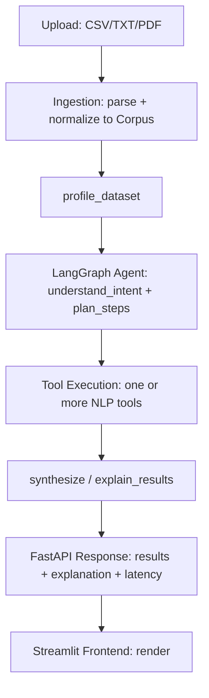

# DATA_FLOW.md — TextInsight

## 1. Overall Flow

- **Upload → ingestion**: file bytes validated (size/type) → parsed into a `Corpus` = list of `Document {id,
  text, metadata}`. CSV rows become documents (text column auto-detected in `profile_dataset` if not
  obvious); TXT becomes one document (or line-split for multi-record text files, config-driven); PDF pages
  extracted and either kept as one document or page-segmented, based on length.
- **Ingestion → profiling**: `profile_dataset` runs once per corpus version and is cached in session state;
  every subsequent tool call reads the cached profile rather than recomputing it.
- **Profiling → agent**: profile feeds `understand_intent` (to interpret ambiguous queries against actual
  data shape) and `plan_steps` (to decide, e.g., whether classification needs candidate labels the user
  hasn't given yet).
- **Agent → tools**: see `AGENT_WORKFLOWS.md` for exact per-feature tool sequences.
- **Tools → models**: each tool internally calls its bound HF pipeline / Sentence-Transformer / FAISS index
  / search API, per `TOOLS_AND_MODELS.md`.
- **Tools → results**: structured, typed (Pydantic) outputs accumulate in `AgentState.tool_results`.
- **Results → explanation**: `synthesize` reads `tool_results` (+ `research_evidence` if present) and
  produces the final natural-language answer, never introducing facts not present in `tool_results`.
- **→ frontend**: FastAPI returns one JSON payload per query containing the explanation, raw per-tool
  results (for tables/charts), latency breakdown, and (if applicable) research citations; Streamlit renders
  each section.

## 2. Per-Feature Data Flow

### Sentiment analysis
`Corpus → profile_dataset (text_column) → sentiment_analysis (per-doc label/score) → synthesize (distribution
+ examples) → response`

### Classification
`Corpus → profile_dataset → [candidate_labels from query or user prompt] → text_classification (per-doc
label/score) → synthesize → response`

### NER
`Corpus → profile_dataset → named_entity_recognition (per-doc entities + aggregate counts) → synthesize →
response`

### Summarization
`Corpus (or filtered subset) → summarize_text → synthesize (light wrapper, mostly passes summary through) →
response`

### Semantic search
`Corpus → generate_embeddings (build/reuse FAISS index) → semantic_search (query embed + KNN) → synthesize
(contextualizes matches) → response`

### Diagnostic multi-step ("why unhappy")
`Corpus → profile_dataset → sentiment_analysis → filter_documents(negative) → generate_embeddings (on
filtered subset if not already indexed) → semantic_search or topic grouping over filtered subset →
summarize_text (digest of dominant negative themes) → synthesize (causal explanation, evidence-linked) →
response`

### Model recommendation (dataset-aware only)
`Corpus → profile_dataset (size, balance, length, labels, language) → evaluate_candidates (if labels exist —
real accuracy/F1 on user's own data, else skipped with a stated reason) → model_recommendation (rule-based
candidates + real evaluation numbers + LLM rationale) → response`

### Model recommendation (research-backed)
`Corpus → profile_dataset → evaluate_candidates (if labels exist) → research_models (search API → attributed
evidence) → model_recommendation (profile + measured results + evidence → labeled recommendation) →
response`

### Conversational follow-up
`chat_history + prior tool_results (session state) → understand_intent (resolve references like "those
negative ones") → plan_steps (often shorter — reuses cached results instead of recomputing) →
[targeted tool calls only for what's new] → synthesize → response`

## 3. Session State Boundaries

- Each upload creates/replaces a `corpus_ref` tied to `session_id`.
- `profile`, `tool_results` from completed turns, and the FAISS index persist for the life of the session
  (in-memory + on-disk index file), enabling follow-ups without recompute.
- A new upload in the same session invalidates the cached profile/index for the previous corpus (explicitly,
  not silently — the agent should tell the user analysis now applies to the new file).
